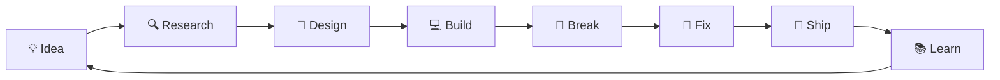

# ⚡ ANSH NARSALE

### `Computer Engineer` · `Builder` · `AI Explorer` · `Linux Enthusiast`

<p align="center">
  
</p>

<p align="center">
  
  
  
</p>

---

## 🧠 `whoami`

```text
Name       → Ansh Narsale
Role       → Computer Engineering Student
Focus      → AI • Full Stack • Systems • Cybersecurity
Environment→ Linux + Windows
Editor     → VS Code
Currently  → Building weird & useful things
Mindset    → Learn → Build → Break → Fix → Repeat
```

I'm a **Computer Engineering student** who likes going beyond tutorials and building things from scratch.

My interests sit somewhere between:

**AI × Web Development × Linux × Networking × Cybersecurity × Developer Tools**

I like projects that solve actual problems, look good, and make people ask:

> **"Wait... you built this yourself?"**

---

## 🚧 CURRENTLY BUILDING

```diff
+ AI-powered developer tools
+ Full-stack applications
+ Experimental Linux projects
+ Cybersecurity & networking tools
+ AI × Blockchain concepts
+ Random ideas that somehow become projects
```

---

## 🧪 MY TECH LAB

### Languages


### Frontend


### Backend & Database


### Systems & Tools


---

# 🧬 PROJECT DNA

## 🤖 MorphLabs AI

> **An AI-powered development ecosystem.**

A collection of AI-powered developer tools designed around the idea of making software development faster and more accessible.

**CodeMorph** → AI website builder
**DevMorph** → Online code editor
**ByteMorph** → AI component generator

`Next.js` `React` `Tailwind` `AI`

---

## 🎵 Bhai FM

> **A music player built with personality.**

A dedicated music-player experience built with React and Vite, focused around Salman Khan songs and a cinematic music-player interface.

`React` `Vite` `JavaScript` `CSS`

---

## 🐧 ShadeOS

> **Linux, but the way I wanted it.**

An experimental Ubuntu-based Linux distribution designed around different operating modes.

```text
SECURE MODE   → Everyday use + Internet
STUDENT MODE  → Development + Tools
RESCUE MODE   → System recovery + Repair
```

`Ubuntu` `Linux` `KDE` `Shell`

---

## ⛓️ AI × BLOCKCHAIN

Exploring decentralized systems for real-world applications such as:

* Academic record verification
* Digital identity
* Secure document storage
* Decentralized social platforms
* AI-powered blockchain applications

`Web3` `Blockchain` `Ganache` `Smart Contracts`

---

# 🛰️ TECH RADAR

| Area                       | Status           |
| -------------------------- | ---------------- |
| 🌐 Full Stack              | 🟢 Building      |
| 🤖 Artificial Intelligence | 🟢 Exploring     |
| 🐧 Linux                   | 🟢 Deep Diving   |
| 📡 Networking              | 🟢 Learning      |
| 🔐 Cybersecurity           | 🟡 Exploring     |
| ⛓️ Blockchain              | 🟡 Experimenting |
| ☁️ Cloud                   | 🟡 Learning      |
| 🧠 Machine Learning        | 🟡 Exploring     |

---

# ⚙️ HOW I BUILD



---

# 📊 GITHUB // SYSTEM STATUS

<p align="center">
  
  
</p>

<p align="center">
  
</p>

---

# 🐍 CONTRIBUTION PROTOCOL

<p align="center">
  
</p>

---

# 🧩 RANDOM FACTS

```yaml
favorite_environment: Linux
favorite_stack: React + Node
currently_learning:
  - AI
  - Cybersecurity
  - Networking
  - Cloud
  - System Development

things_I_enjoy:
  - Building side projects
  - Breaking Linux installations
  - Experimenting with AI
  - Creating weird ideas
  - Fixing things I broke

development_cycle:
  - "I have an idea"
  - "This should be easy"
  - "Why isn't this working?"
  - "Oh..."
  - "IT WORKS!"
```

---

# 🌐 FIND ME

<p align="center">

<a href="https://github.com/anshnarsale">

</a>

<a href="https://www.linkedin.com/in/anshnarsale">

</a>

</p>

---

<p align="center">

### `01001000 01101001 👋`

**Thanks for stopping by.**

*The best projects usually start with:*
**"What if we..."**

⭐ Explore my repositories · 🛠️ Build something · 🚀 Ship it

</p>
