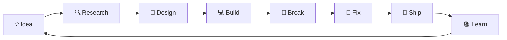

# ⚡ ANSH NARSALE

### `Computer Engineer` · `Builder` · `AI Explorer` · `Linux Enthusiast`

<p align="center">
  
</p>

<p align="center">
  <a href="https://github.com/anshnarsale">
    
  </a>
  
  
</p>

---

## 🧠 `whoami`

```text
Name        → Ansh Narsale
Role        → Computer Engineering Student
Focus       → AI • Full Stack • Systems • Networking • Cybersecurity
Environment → Linux + Windows
Editor      → VS Code
Currently   → Building tools, experiments & weird ideas
Mindset     → Learn → Build → Break → Fix → Repeat
```

I like going beyond tutorials.

I build things to understand how they work — from AI developer tools and
security utilities to Linux experiments, networking projects and full-stack apps.

### Current orbit

**AI × Systems × Linux × Networking × Cybersecurity × Developer Tools**

> "What if we actually build it?"

---

# 🚧 CURRENTLY BUILDING

```diff
+ AI-powered developer tools
+ Cybersecurity & networking utilities
+ Linux experiments
+ Full-stack applications
+ Security research projects
+ AI × systems experiments
+ Open-source contributions
```

---

# 🧬 PROJECT DNA

## 🔐 Security & Systems

<table>
<tr>
<td width="50%">

### 🛡️ Nexus Sentinel

AI-assisted security toolkit for **Windows + Linux**.

Built around security analysis and system-focused tooling, with AI included as part of the project.

`Python` `AI` `Windows` `Linux` `Security`

<a href="https://github.com/anshnarsale/nexus-sentinel">→ View repository</a>

</td>
<td width="50%">

### ⚔️ ShellStrike

Bash-based **Kali Linux security toolkit**.

Includes tooling around network discovery, port scanning, Linux security auditing, log analysis and passive web reconnaissance.

`Bash` `Linux` `Kali` `Networking` `Security`

<a href="https://github.com/anshnarsale/ShellStrike">→ View repository</a>

</td>
</tr>

<tr>
<td>

### 🍯 HoneyForge

A security-focused **honeypot / deception project** built as a hands-on security experiment.

Designed to explore how exposed services can be monitored and analyzed.

`Python` `Linux` `Cybersecurity` `Monitoring`

<a href="https://github.com/anshnarsale/honeyforge">→ View repository</a>

</td>
<td>

### 📱 EvePulse

SMS security simulation project for exploring how suspicious message
flows can be represented and analyzed in a controlled environment.

`Python` `Security` `Simulation`

<a href="https://github.com/anshnarsale/EvePulse">→ View repository</a>

</td>
</tr>
</table>

---

## 🤖 AI & Developer Tools

### 🧪 MorphLabs AI

**Build Smarter. Ship Faster.**

An AI-powered development ecosystem built around three ideas:

```text
CodeMorph  → AI website builder
ByteMorph  → AI component generator
DevMorph   → Online code editor
```

`Next.js` `React` `Tailwind` `Google AI Studio` `AI`

<a href="https://morphlabsai.netlify.app/">→ Explore MorphLabs AI</a>

---

## 🐧 ShadeOS

**Linux, rebuilt around how I wanted to use it.**

An experimental Ubuntu-based privacy-focused operating system concept with
different operating modes and system tools.

```text
SECURE MODE   → Everyday use + Internet
STUDENT MODE  → Development + Tools
RESCUE MODE   → Recovery + Repair
```

`Ubuntu` `Linux` `KDE` `Shell` `Privacy`

---

## 💸 SplitPe — Open Source Contribution

Contributing to **SplitPe**, a Flutter-based UPI payment-splitting project.

My contribution adds automated edge-case coverage for the tranche calculation
engine — testing important boundaries while keeping production logic unchanged.

```text
₹1,999 → 1 tranche
₹3,998 → 2 × ₹1,999
₹3,999 → 3 tranches
₹4,000 → 3 tranches
```

`Flutter` `Dart` `UPI` `Testing` `Open Source`

<a href="https://github.com/TechnoAman/SplitPe">→ View project</a>

---

# 🎵 OTHER BUILDS

### Bhai FM

A React + Vite music-player experience focused around Salman Khan songs.

`React` `Vite` `JavaScript` `CSS`

<a href="https://github.com/anshnarsale/bhai-fm">→ View repository</a>

---

# 🧪 MY TECH LAB

### Languages


### Frontend


### Backend / Data


### Systems / Security / Tools


---

# 🛰️ TECH RADAR

| Area | Status |
|---|---|
| 🌐 Full Stack | 🟢 Building |
| 🤖 Artificial Intelligence | 🟢 Exploring |
| 🐧 Linux | 🟢 Deep Diving |
| 📡 Networking | 🟢 Learning |
| 🔐 Cybersecurity | 🟢 Building |
| 🧪 Security Research | 🟢 Experimenting |
| ⛓️ Blockchain | 🟡 Experimenting |
| ☁️ Cloud | 🟡 Learning |
| 🧠 Machine Learning | 🟡 Exploring |

---

# ⚙️ HOW I BUILD



---

# 📊 GITHUB // SYSTEM STATUS

<p align="center">
  
  
</p>

<p align="center">
  
</p>

---

# 🐍 CONTRIBUTION PROTOCOL

<p align="center">
  
</p>

---

# 🧩 RANDOM FACTS

```yaml
favorite_environment: Linux
favorite_stack: React + Node
current_focus:
  - AI
  - Cybersecurity
  - Networking
  - Linux
  - Systems
  - Open Source

things_I_enjoy:
  - Building side projects
  - Breaking Linux installations
  - Experimenting with AI
  - Exploring security
  - Creating weird ideas
  - Fixing things I broke

development_cycle:
  - "I have an idea"
  - "This should be easy"
  - "Why isn't this working?"
  - "Oh..."
  - "IT WORKS!"
```

---

# 🌐 FIND ME

<p align="center">

<a href="https://github.com/anshnarsale">

</a>

<a href="https://www.linkedin.com/in/anshnarsale">

</a>

<a href="https://anshnarsale.netlify.app/">

</a>

</p>

---

<p align="center">

### `01001000 01101001 👋`

**Build. Break. Learn. Repeat.**

*The best projects usually start with:*

**"What if we..."**

⭐ Explore my repositories · 🛠️ Build something · 🚀 Ship it

</p>
