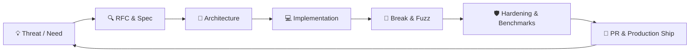

<div align="center">

# ⚡ ANSH NARSALE
### **Cybersecurity Architect • Autonomous AI Systems • Full-Stack Engineer**

<a href="https://git.io/typing-svg"></a>

<br/>

[](https://github.com/anshnarsale)
[](https://github.com/anshnarsale?tab=repositories)
[](https://github.com/anshnarsale)
[](https://github.com/anshnarsale?tab=followers)
[](https://anshnarsale.netlify.app/)
[](https://www.linkedin.com/in/anshnarsale)

</div>

---

### 🖥️ `SYS_STATUS: ACTIVE`

```yaml
Identity     : Ansh Narsale (anshnarsale)
Specialization: Defensive Network Security • Autonomous Agents • Full-Stack Systems
Core Stack   : Python 3.12 | FastAPI | TypeScript | Next.js 14 | Linux / POSIX | SQLite | Docker
Security Ops : Suricata IDS | Threat Intelligence (IOCs) | SIEM CEF Protocol | Argon2id & WebAuthn
Cadence      : Daily active commits • Prolific PR merging • Architecture-first development
Philosophy   : "If it touches the packet, kernel, or prompt — build it from scratch to master it."
```

---

## 📈 **LIVE DYNAMIC ACTIVITY & METRICS**

<div align="center">


</div>

<div align="center">
  
</div>

---

## 🛡️ **FLAGSHIP DEPLOYMENTS & ARCHITECTURE**

<table>
  <thead>
    <tr>
      <th width="50%">🚀 Production Systems</th>
      <th width="50%">🎯 Engineering Capabilities</th>
    </tr>
  </thead>
  <tbody>
    <tr>
      <td>
        <h3>🛡️ <a href="https://github.com/anshnarsale/EvePulse">EvePulse v0.3.0</a></h3>
        <p><b>Enterprise Suricata IDS Network Monitor & Behavioral Abuse Engine</b></p>
        <ul>
          <li>⚡ <b>Real-time Telemetry:</b> Ingests live <code>eve.json</code> Suricata packet flows</li>
          <li>📊 <b>Persistent Forensics:</b> Built-in SQLite event warehouse with time-series indexing</li>
          <li>🚨 <b>SIEM Ingestion:</b> Multi-format exporter (ArcSight CEF, RFC 4180 CSV, JSON, Markdown)</li>
          <li>🖥️ <b>Zero-Dep SOC Dashboard:</b> Embedded dark-mode HTTP interface on port <code>8088</code></li>
          <li>🔔 <b>Alert Dispatcher:</b> Discord & Slack webhook notifications for high-severity bursts</li>
        </ul>
        <code>Python 3.12</code> <code>Suricata IDS</code> <code>SQLite</code> <code>CEF</code> <code>SIEM</code> <code>SOC</code>
        <br/><br/>
        <a href="https://github.com/anshnarsale/EvePulse"><b>→ Explore EvePulse Repository</b></a> (7 Merged PRs)
      </td>
      <td>
        <h3>🍯 <a href="https://github.com/anshnarsale/honeyforge">HoneyForge v0.2.0</a></h3>
        <p><b>Next-Gen Deception Platform & Attacker Intelligence Framework</b></p>
        <ul>
          <li>🪤 <b>Multi-Protocol Honeypots:</b> Emulates realistic SSH, HTTP, and TCP decoy services</li>
          <li>🌍 <b>GeoIP Enrichment:</b> In-memory LRU cached attacker ASN and geolocation lookups</li>
          <li>📈 <b>Attacker Profiling:</b> Tracks top attack paths, SSH command sequences, and source IPs</li>
          <li>🐳 <b>Turnkey Cluster:</b> Non-root containerized deployment with Docker Compose</li>
        </ul>
        <code>FastAPI</code> <code>Python</code> <code>Next.js</code> <code>Docker</code> <code>Threat Intel</code>
        <br/><br/>
        <a href="https://github.com/anshnarsale/honeyforge"><b>→ Explore HoneyForge Repository</b></a> (7 Merged PRs)
      </td>
    </tr>
    <tr>
      <td>
        <h3>⚔️ <a href="https://github.com/anshnarsale/ShellStrike">ShellStrike v1.2.0</a></h3>
        <p><b>Advanced Kali Linux Offensive & Defensive Reconnaissance Suite</b></p>
        <ul>
          <li>🔍 <b>Port Scanner:</b> Multi-threaded TCP SYN socket probing with service banner grabbing</li>
          <li>🌐 <b>Web Recon:</b> Automated directory traversal fuzzer with intelligent rate-limiting</li>
          <li>🛡️ <b>WAF Fingerprinting:</b> Detects Cloudflare, AWS WAF, Akamai, and Imperva defenses</li>
          <li>📡 <b>Passive DNS:</b> Certificate Transparency log extraction for deep subdomain recon</li>
        </ul>
        <code>Bash</code> <code>Kali Linux</code> <code>Nmap</code> <code>Socket I/O</code> <code>Reconnaissance</code>
        <br/><br/>
        <a href="https://github.com/anshnarsale/ShellStrike"><b>→ Explore ShellStrike Repository</b></a> (6 Merged PRs)
      </td>
      <td>
        <h3>🔑 <a href="https://github.com/anshnarsale/3fa-project">3FA Security Suite</a></h3>
        <p><b>Zero-Trust Multi-Factor Authentication Architecture</b></p>
        <ul>
          <li>👆 <b>Hardware Biometrics:</b> WebAuthn / FIDO2 public key cryptographic registration</li>
          <li>🔒 <b>Memory-Hard Crypto:</b> Modern Argon2id password hashing with PBKDF2 salting</li>
          <li>⏱️ <b>Drift Tolerance:</b> Dynamic TOTP clock-drift tolerance window (+/- 30s)</li>
          <li>⛔ <b>Anti-Bruteforce:</b> Exponential backoff delay & instant JWT session revocation</li>
        </ul>
        <code>Cryptography</code> <code>WebAuthn</code> <code>FIDO2</code> <code>Argon2id</code> <code>TOTP</code> <code>OWASP</code>
        <br/><br/>
        <a href="https://github.com/anshnarsale/3fa-project"><b>→ Explore 3FA Suite Repository</b></a> (6 Merged PRs)
      </td>
    </tr>
    <tr>
      <td>
        <h3>🤖 <a href="https://github.com/anshnarsale/nexus-sentinel">Nexus Sentinel</a></h3>
        <p><b>Autonomous Multi-Agent Runtime & Task Supervision Engine</b></p>
        <ul>
          <li>⚙️ <b>Async Scheduler:</b> Priority queue task execution with deadlock watchdog supervision</li>
          <li>📦 <b>Process Sandbox:</b> Isolated execution groups with strict CPU and memory quotas</li>
          <li>📡 <b>Distributed Tracing:</b> Structured JSON audit logging for agent decision chains</li>
          <li>🧠 <b>Memory Compaction:</b> Rolling token-efficient buffer summarization algorithm</li>
        </ul>
        <code>Autonomous AI</code> <code>Distributed Systems</code> <code>Python</code> <code>Concurrency</code>
        <br/><br/>
        <a href="https://github.com/anshnarsale/nexus-sentinel"><b>→ Explore Nexus Sentinel</b></a> (6 Merged PRs)
      </td>
      <td>
        <h3>⚡ <a href="https://github.com/anshnarsale/ai-saas">AI-SaaS Platform</a></h3>
        <p><b>Enterprise AI Generation Stack with Real-Time Streaming</b></p>
        <ul>
          <li>🌊 <b>Live SSE Streaming:</b> Real-time token streaming with client abort propagation</li>
          <li>💳 <b>Monetization:</b> Stripe webhook billing & subscription lifecycle synchronization</li>
          <li>📊 <b>Usage Telemetry:</b> Per-user prompt & completion token expenditure tracking</li>
          <li>📑 <b>OpenAPI v3:</b> Fully documented interactive REST API contract</li>
        </ul>
        <code>Next.js 14</code> <code>Node.js</code> <code>Stripe</code> <code>TailwindCSS</code> <code>SSE</code>
        <br/><br/>
        <a href="https://github.com/anshnarsale/ai-saas"><b>→ Explore AI-SaaS Repository</b></a> (5 Merged PRs)
      </td>
    </tr>
  </tbody>
</table>

---

## 🎵 **CREATIVE ENGINEERING & LAB EXPERIMENTS**

<div align="center">

| Project | Highlights | Stack |
|---|---|---|
| 🎵 **[Bhai-FM](https://github.com/anshnarsale/bhai-fm)** | **Cinematic Web Music Player** • Web Audio API 64-band frequency visualizer • Dynamic ambient artwork backdrop blur • Media Session lock screen controls | `React` `Vite` `Web Audio API` `Canvas` |
| 🧪 **[MorphLabs AI](https://morphlabsai.netlify.app/)** | **AI Development Suite** • **CodeMorph** (AI website builder), **ByteMorph** (Dynamic component synthesizer), **DevMorph** (In-browser code editor) | `Next.js` `TailwindCSS` `Gemini AI` |
| 💸 **[SplitPe Contribution](https://github.com/TechnoAman/SplitPe)** | **Open-Source UPI Engine** • Engineered automated boundary test coverage for tranche splitting algorithm | `Flutter` `Dart` `UPI Engine` |

</div>

---

# 🛠️ **TECH ARSENAL & TOOLBOX**

<div align="center">

### **Security, Telemetry & Network Forensics**
[](https://suricata.io/)
[](https://kali.org/)
[](https://wireshark.org/)
[](https://nmap.org/)
[](https://splunk.com/)
[](https://fidoalliance.org/)

### **Languages & Core Frameworks**
[](https://python.org/)
[](https://fastapi.tiangolo.com/)
[](https://typescriptlang.org/)
[](https://nextjs.org/)
[](https://react.dev/)
[](https://gnu.org/software/bash/)
[](https://sqlite.org/)

### **Infrastructure, DevOps & Systems**
[](https://docker.com/)
[](https://kernel.org/)
[](https://git-scm.com/)
[](https://github.com/features/actions)

</div>

---

# 🚀 **HOW I BUILD: THE SYSTEMIC SPRINT CYCLE**


```mermaid
flowchart LR
    A[💡 Threat / Need] --> B[🔍 RFC & Spec]
    B --> C[📐 Architecture]
    C --> D[💻 Implementation]
    D --> E[🧪 Break & Fuzz]
    E --> F[🛡️ Hardening & Benchmarks]
    F --> G[🚀 PR & Production Ship]
    G --> A
```

---

# 🐍 **CONTRIBUTION CADENCE**

<div align="center">
  
</div>

---

# 🤝 **CONNECT WITH ME**

<div align="center">

[](https://anshnarsale.netlify.app/)
[](https://www.linkedin.com/in/anshnarsale)
[](https://github.com/anshnarsale)

<br/>

> *"True engineering is not just writing code that runs — it is building systems that survive the storm."*

⭐ **Explore the repositories above · PRs & Collaborations are always welcome!**

</div>
